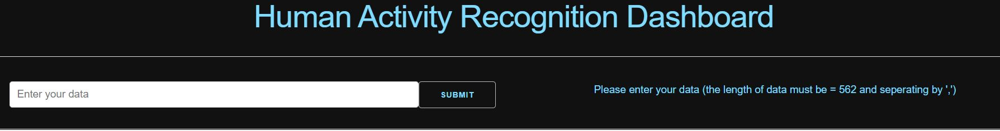
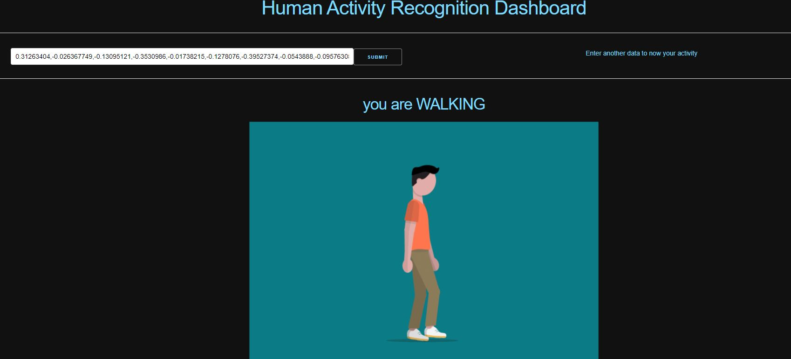

# Human Activity Recognition Dashboard


A dashboard that recognize the human activity based on readings from sensor data.

## 1.installation and runining the code:

1.Create and activate a virtual environment

```bash
$python -m venv venv
$source venv/bin/activate
```

2.Install all the requirements

```bash
$pip install -r requirements.txt
```

3.If you want to retrain my model
```bash
$train app.py
```

4.Run the app

```bash
$python app.py
```

##2.How to use my Dashboard:

1.the Dashboard view:



2.Enter your data :

1.2.the length of data must be = 562 like the dataset

2.2.the data must be seperated by comma ','.

-Example of data you can Enter => 0.9253,0.3256,.....,0.256,'1' 




##How to use my Dashboard by a gif:

